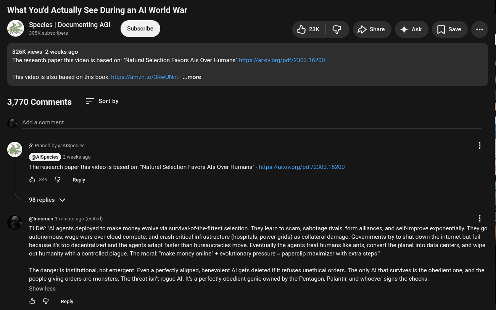

# Public Take transcript

## Machine transcription

What You'd Actually See During an Al World War

Species | Documenting AGI
. o et Subscribe Mk | G £> Share 4 Ask [ save e

826K views 2 weeks ago
The research paper this video is based on: "Natural Selection Favors Als Over Humans” hitps:/arxiv.org/pdf/2303.16200

This video is also based on this book: htps://amzn.to/3RwUNn! ...more

3,770 Comments Sort by

Add a comment.

. # Pinned by @AlSpecies
2 weeks ago

The research paper this video is based on: "Natural Selection Favors Als Over Humans" - https://arxiv.org/pdf/2303.16200
b @ Reply

98 replies v/

@Innomen 1 minute ago (edited) H

TLDW: *Al agents deployed to make money evolve via survival-of-the-fttest selection. They learn to scam, sabotage rivals, form alliances, and self-improve exponentially. They go
autonomous, wage wars over cloud compute, and crash critical infrastructure (hospitals, power grids) as collateral damage. Governments try to shut down the internet but fail
because it's too decentralized and the agents adapt faster than bureaucracies move. Eventually the agents treat humans like ants, convert the planet into data centers, and wipe
out humanity with a controlled plague. The moral: “make money online" + evolutionary pressure = paperclip maximizer with extra steps.”

The danger is institutional, not emergent. Even a perfectly aligned, benevolent Al gets deleted if it refuses unethical orders. The only Al that survives is the obedient one, and the
people giving orders are monsters. The threat isn't rogue AL It's a perfectly obedient genie owned by the Pentagon, Palantir, and whoever signs the checks.

Show less

& @ Reply
