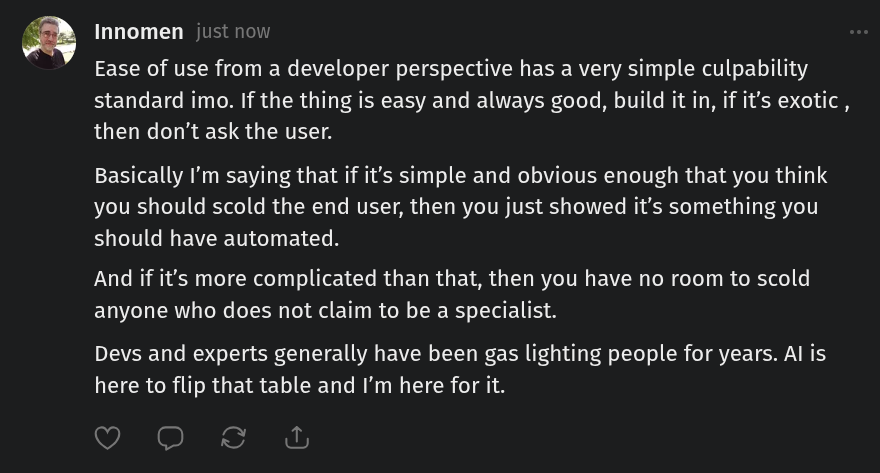

# Public Take transcript

## Machine transcription

Innomen just now

Ease of use from a developer perspective has a very simple culpability
standard imo. If the thing is easy and always good, build it in, if it's exotic ,
then don't ask the user.

Basically I'm saying that if it’s simple and obvious enough that you think
you should scold the end user, then you just showed it's something you
should have automated.

And if it's more complicated than that, then you have no room to scold
anyone who does not claim to be a specialist.

Devs and experts generally have been gas lighting people for years. Al is
here to flip that table and I'm here for it.

(VGRS A
