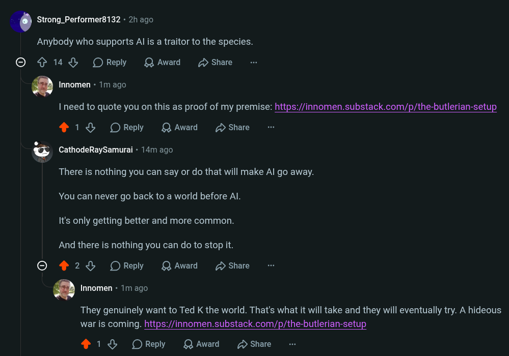

# Public Take transcript

## Machine transcription

‘ Strong_Performer8132 - 2h ago
Anybody who supports Al is a traitor to the species.

© ¢ 14 L OReply QAward D Share

. Innomen - 1m ago

I need to quote you on this as proof of my premise: https:/innomen.substack.com/p/the-butlerian-setup
418 OReply QAward D Share
.

@ CathodeRaySamurai + 14m ago

There is nothing you can say or do that will make Al go away.
You can never go back to a world before Al.
It's only getting better and more common.

And there is nothing you can do to stop it.

© 428 OReply QAwad D Share

. Innomen « 1m ago.

They genuinely want to Ted K the world. That's what it will take and they will eventually try. A hideous
war is coming. https://innomen.substack.com/p/the-butlerian-setup

218 OReply QAward D Share
