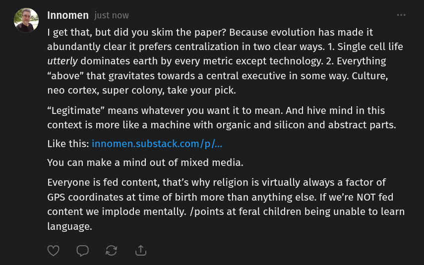

# Public Take transcript

## Machine transcription

fi Innomen just now

| get that, but did you skim the paper? Because evolution has made it
abundantly clear it prefers centralization in two clear ways. 1. Single cell life
utterly dominates earth by every metric except technology. 2. Everything
“above” that gravitates towards a central executive in some way. Culture,
neo cortex, super colony, take your pick.

“Legitimate” means whatever you want it to mean. And hive mind in this
context is more like a machine with organic and silicon and abstract parts.

Like this: innomen.substack.com/p/...
You can make a mind out of mixed media.

Everyone is fed content, that's why religion is virtually always a factor of
GPS coordinates at time of birth more than anything else. If we're NOT fed
content we implode mentally. /points at feral children being unable to learn
language.

O 0O &
