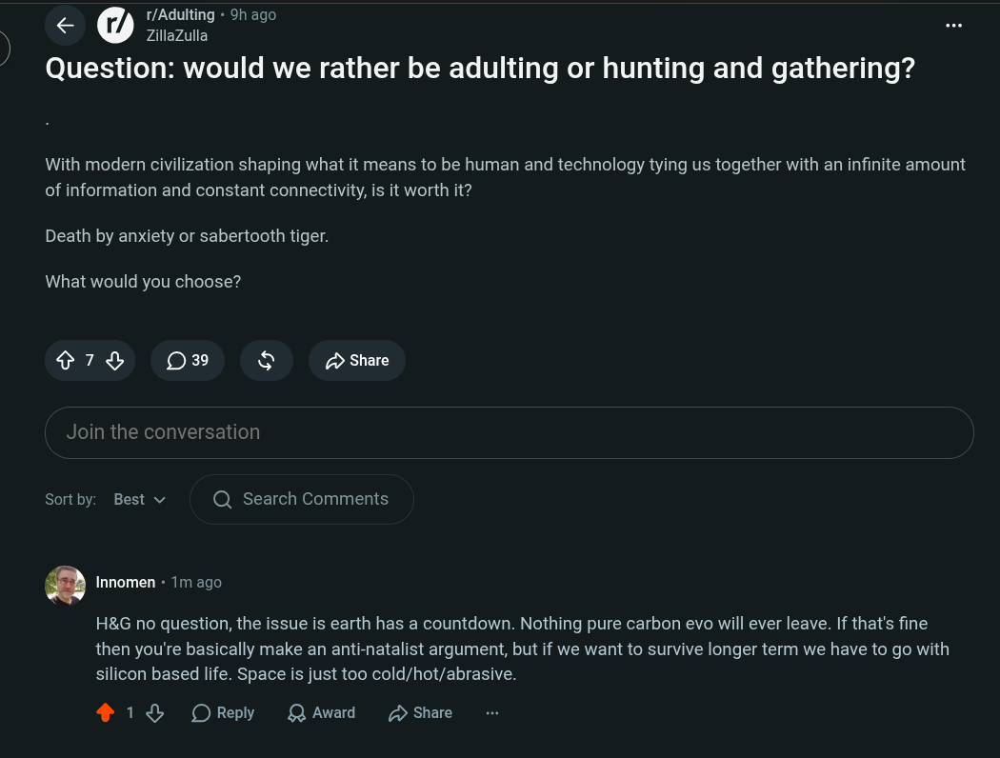

# Public Take transcript

## Machine transcription

1/Adulting - 9h ago
< Q Zillazulla

Question: would we rather be adulting or hunting and gathering?

With modern civilization shaping what it means to be human and technology tying us together with an infinite amount
of information and constant connectivity, is it worth it?

Death by anxiety or sabertooth tiger.

What would you choose?

79 039 & > Share
Join the conversation

Sortby: Best v Q Search Comments

a Innomen « 1m ago

H&G no question, the issue is earth has a countdown. Nothing pure carbon evo will ever leave. If that's fine
then you're basically make an anti-natalist argument, but if we want to survive longer term we have to go with
silicon based life. Space is just too cold/hot/abrasive.

418 OReply QAward 2 Share
