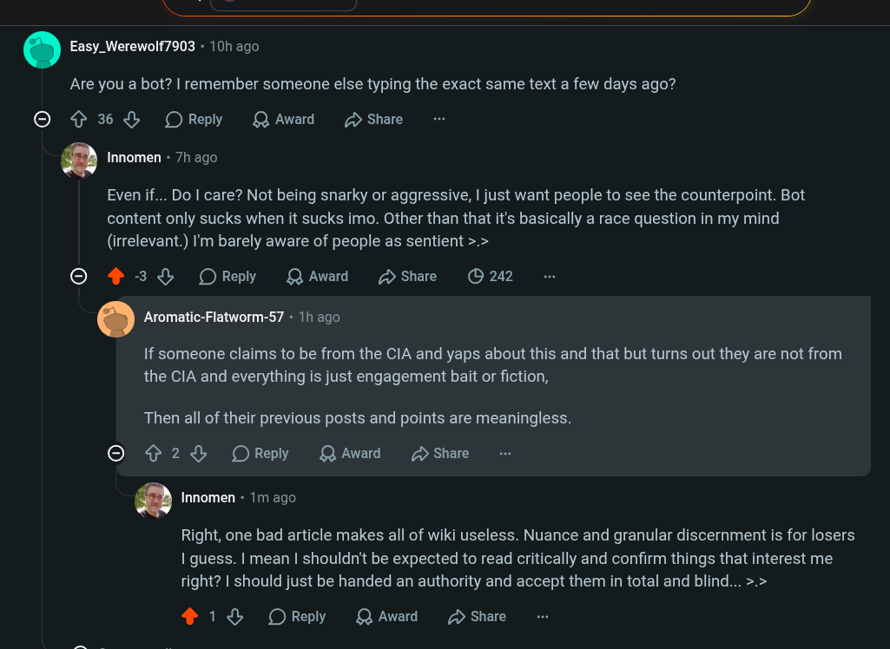

# Public Take transcript

## Machine transcription

. Easy_Werewolf7903 - 10h ago

Are you a bot? | remember someone else typing the exact same text a few days ago?

© {36 OReply QAward D Share

Q Innomen - 7h ago

Even if... Do | care? Not being snarky or aggressive, | just want people to see the counterpoint. Bot
content only sucks when it sucks imo. Other than that it's basically a race question in my mind
(irrelevant.) I'm barely aware of people as sentient >.>

© 4 3% OReply QAward SsShare (O 242

. Aromatic-Flatworm-57 - 1h ago

If someone claims to be from the CIA and yaps about this and that but turns out they are not from
the CIA and everything is just engagement bait or fiction,

Then all of their previous posts and points are meaningless.

O ¢ 2 OReply QAward 2 Share

Q Innomen « 1m ago

Right, one bad article makes all of wiki useless. Nuance and granular discernment is for losers
I guess. | mean | shouldn't be expected to read critically and confirm things that interest me
right? | should just be handed an authority and accept them in total and blind... >.>

418 OReply QAward 2 Share
