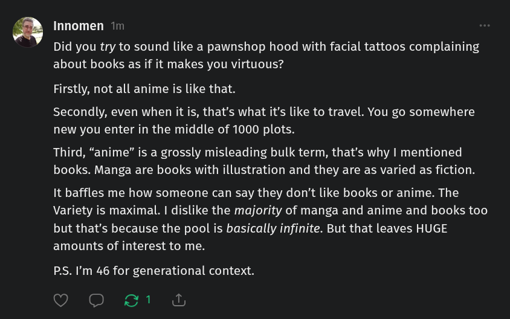

# Public Take transcript

## Machine transcription

B

Innomen 1

Did you try to sound like a pawnshop hood with facial tattoos complaining
about books as if it makes you virtuous?

Firstly, not all anime is like that.

Secondly, even when it is, that’s what it’s like to travel. You go somewhere
new you enter in the middle of 1000 plots.

Third, “anime” is a grossly misleading bulk term, that's why | mentioned
books. Manga are books with illustration and they are as varied as fiction.

It baffles me how someone can say they don't like books or anime. The
Variety is maximal. | dislike the majority of manga and anime and books too
but that's because the pool is basically infinite. But that leaves HUGE
amounts of interest to me.

PS. I'm 46 for generational context.

o O &1 g
