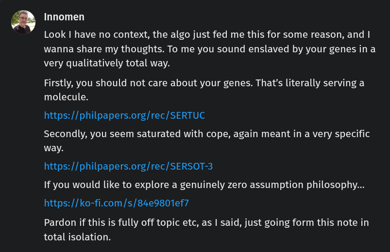

# Public Take transcript

## Machine transcription

fi Innomen

Look | have no context, the algo just fed me this for some reason, and |
wanna share my thoughts. To me you sound enslaved by your genes in a
very qualitatively total way.

Firstly, you should not care about your genes. That's literally serving a
molecule.

https://philpapers.org/rec/SERTUC

Secondly, you seem saturated with cope, again meant in a very specific
way.

https://philpapers.org/rec/SERSOT-3
If you would like to explore a genuinely zero assumption philosophy...
https://ko-fi.com/s/84e9801ef7

Pardon if this is fully off topic etc, as | said, just going form this note in
total isolation.
