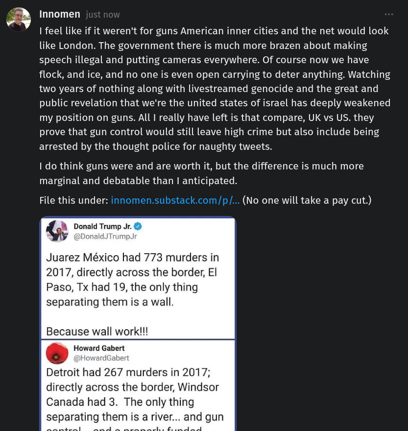

# Public Take transcript

## Machine transcription

& Innomen
2

| feel like if it weren't for guns American inner cities and the net would look
like London. The government there is much more brazen about making
speech illegal and putting cameras everywhere. Of course now we have
flock, and ice, and no one is even open carrying to deter anything. Watching
two years of nothing along with livestreamed genocide and the great and
public revelation that we're the united states of israel has deeply weakened
my position on guns. All | really have left is that compare, UK vs US. they
prove that gun control would still leave high crime but also include being
arrested by the thought police for naughty tweets.

| do think guns were and are worth it, but the difference is much more
marginal and debatable than I anticipated.

File this under: innomen.substack.com/p/... (No one will take a pay cut.)

onald Trump Jr.
aldJTrumpJr

Juarez México had 773 murders in
2017, directly across the border, El
Paso, Tx had 19, the only thing
separating them is a wall.

Because wall work!

. Howard Gabert

Detroit had 267 murders in 2017;
directly across the border, Windsor
Canada had 3. The only thing
separating them is a river..
