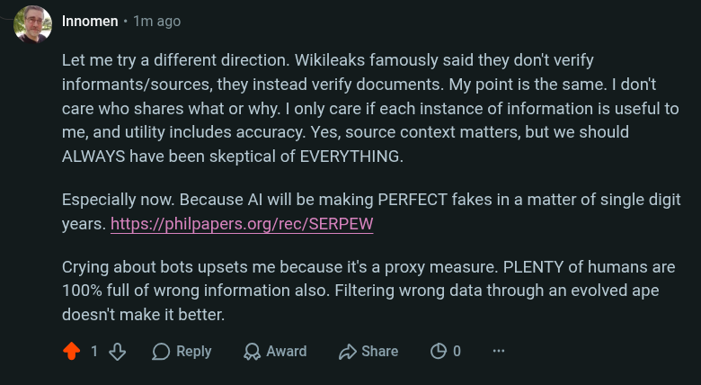

# Public Take transcript

## Machine transcription

. Innomen « 1m ago.

Let me try a different direction. Wikileaks famously said they don't verify
informants/sources, they instead verify documents. My point is the same. | don't
care who shares what or why. | only care if each instance of information is useful to
me, and utility includes accuracy. Yes, source context matters, but we should
ALWAYS have been skeptical of EVERYTHING.

Especially now. Because Al will be making PERFECT fakes in a matter of single digit
years. https://philpapers.org/rec/SERPEW

Crying about bots upsets me because it's a proxy measure. PLENTY of humans are
100% full of wrong information also. Filtering wrong data through an evolved ape
doesn't make it better.

418 OReply QAward Hshae OO0
