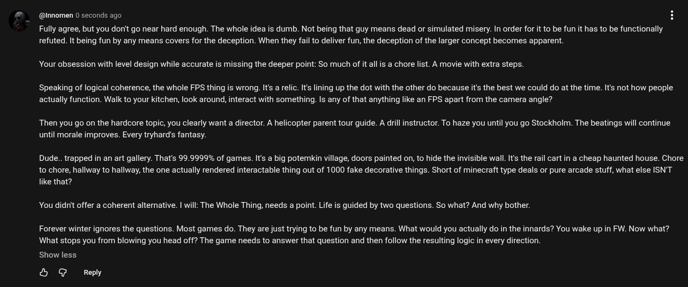

# Public Take transcript

## Machine transcription

@nnomen 0 seconds ago

Fully agree, but you don't go near hard enough. The whole idea is dumb. Not being that guy means dead or simulated misery. In order for it to be fun it has to be functionally
refuted. It being fun by any means covers for the deception. When they fail to deliver fun, the deception of the larger concept becomes apparent.

Your obsession with level design while accurate is missing the deeper point: So much of it allis a chore list. A movie with extra steps.

Speaking of logical coherence, the whole FPS thing is wrong. It's a relic. Its lining up the dot with the other do because it's the best we could do at the time. It's not how people
actually function. Walk to your kitchen, look around, interact with something. Is any of that anything like an FPS apart from the camera angle?

Then you go on the hardcore topic, you clearly want a director. A helicopter parent tour guide. A drill instructor. To haze you until you go Stockholm. The beatings will continue
until morale improves. Every tryhard's fantasy.

Dude.. trapped in an art gallery. That's 99.9999% of games. It's a big potemkin village, doors painted on, to hide the invisible wall. It's the rail cart in a cheap haunted house. Chore
to chore, hallway to hallway, the one actually rendered interactable thing out of 1000 fake decorative things. Short of minecraft type deals or pure arcade stuff, what else ISN'T
like that?

You didnit offer a coherent alternative. | will: The Whole Thing, needs a point. Life is guided by two questions. So what? And why bother.

Forever winter ignores the questions. Most games do. They are just trying to be fun by any means. What would you actually do in the innards? You wake up in FW. Now what?
What stops you from blowing you head off? The game needs to answer that question and then follow the resulting logic in every direction.

Show less

& @ Reply
