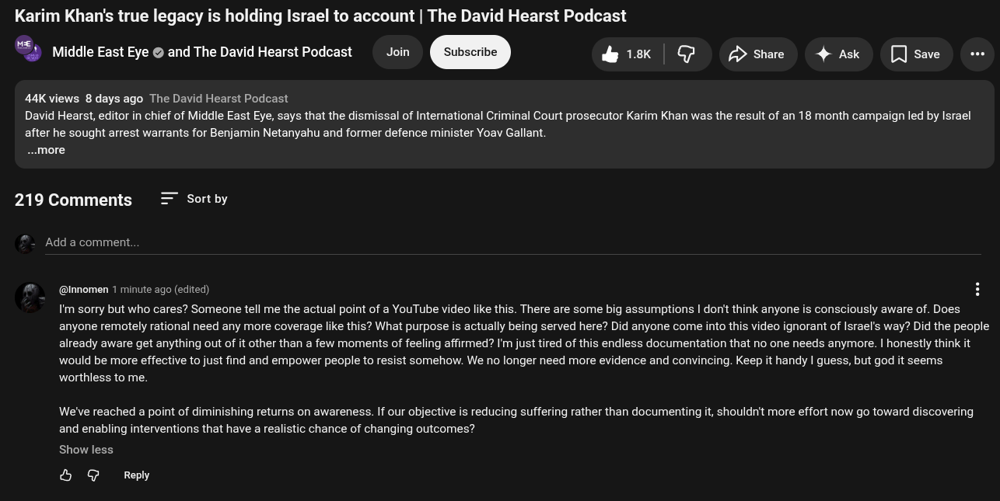

# Public Take transcript

## Machine transcription

Karim Khan's true legacy is holding Israel to account | The David Hearst Podcast

Middle East Eye @ and The David Hearst Podcast  Join &1k | G Dshae 4 Ak [Jsave e

44K views 8 days ago The David Hearst Podcast

David Hearst, editor in chief of Middle East Eye, says that the dismissal of Interational Criminal Court prosecutor Karim Khan was the resuit of an 18 month campaign led by Israel
after he sought arrest warrants for Benjamin Netanyahu and former defence minister Yoav Gallant.
...more

219 Comments Sort by

Add a comment.

@Innomen 1 minute ago (edited)

I'm sorry but who cares? Someone tell me the actual point of a YouTube video like this. There are some big assumptions | donit think anyone i consciously aware of. Does
anyone remotely rational need any more coverage like this? What purpose is actually being served here? Did anyone come into this video ignorant of Israel's way? Did the people
already aware get anything out of it other than a few moments of feeling affirmed? I'm just tired of this endless documentation that no one needs anymore. | honestly think it

would be more effective to just find and empower people to resist somehow. We no longer need more evidence and convincing. Keep it handy | guess, but god it seems.
worthless to me.

We've reached a point of diminishing returns on awareness. If our objective is reducing suffering rather than documenting it, shouldn't more effort now go toward discovering
and enabling interventions that have a realistic chance of changing outcomes?

Show less

& @ Reply
