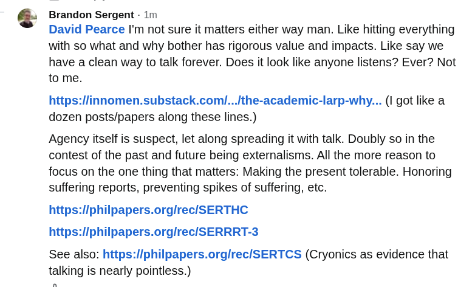

# Public Take transcript

## Machine transcription

Brandon Sergent - Im

David Pearce I'm not sure it matters either way man. Like hitting everything
with so what and why bother has rigorous value and impacts. Like say we
have a clean way to talk forever. Does it look like anyone listens? Ever? Not
to me.

https:/linnomen.substack.coml...lthe-academic-larp-why... (I got like a
dozen posts/papers along these lines.)

Agency itself is suspect, let along spreading it with talk. Doubly so in the
contest of the past and future being externalisms. All the more reason to
focus on the one thing that matters: Making the present tolerable. Honoring
suffering reports, preventing spikes of suffering, etc.

https:liphilpapers.orglrec/SERTHC
https:liphilpapers.orglrec/SERRRT-3

See also: https:liphilpapers.orglrec/SERTCS (Cryonics as evidence that
talking is nearly pointless.)
