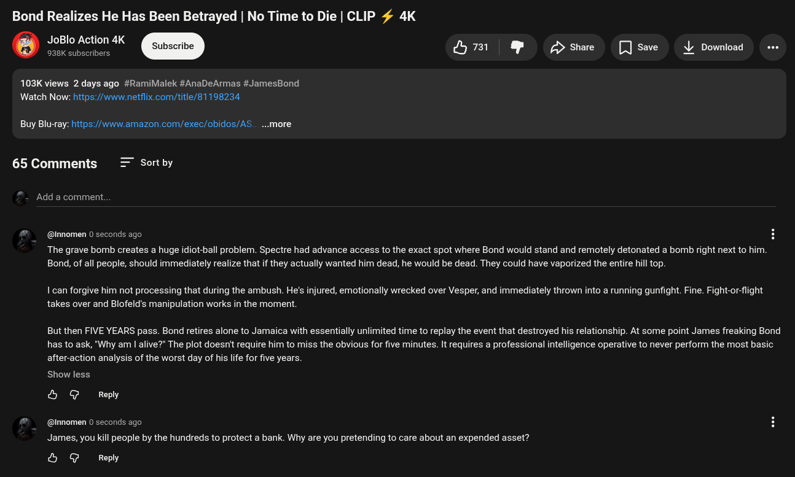

# Public Take transcript

## Machine transcription

Bond Realizes He Has Been Betrayed | No Time to Die | CLIP # 4K

JoBlo Action 4K
e e Subscribe i & £> share [ save ' Download

103K views 2 days ago #RamiMalek #AnaDeArmas #JamesBond
Watch Now: https:/www.netflix.com/title/81198234

Buy Blu-ray: https://www.amazon.com/exec/obidos/AS.. ...more

65 Comments = Sortby

Add a comment.

@nnomen 0 seconds ago

The grave bomb creates a huge idiot-ball problem. Spectre had advance access to the exact spot where Bond would stand and remotely detonated a bomb right next to him.
Bond, of all people, should immediately realize that if they actually wanted him dead, he would be dead. They could have vaporized the entire hill top.

I can forgive him not processing that during the ambush. He's injured, emotionally wrecked over Vesper, and immediately thrown into a running gunfight. Fine. Fight-or-flight
takes over and Blofeld's manipulation works in the moment

But then FIVE YEARS pass. Bond retires alone to Jamaica with essentially unlimited time to replay the event that destroyed his relationship. At some point James freaking Bond
has to ask, "Why am | alive?” The plot doesn't require him to miss the obvious for five minutes. It requires a professional intelligence operative to never perform the most basic
after-action analysis of the worst day of his life for five years.

Show less

& @ Reply

@nnomen 0 seconds ago

James, you kil people by the hundreds to protect a bank. Why are you pretending to care about an expended asset?

& @ Reply
