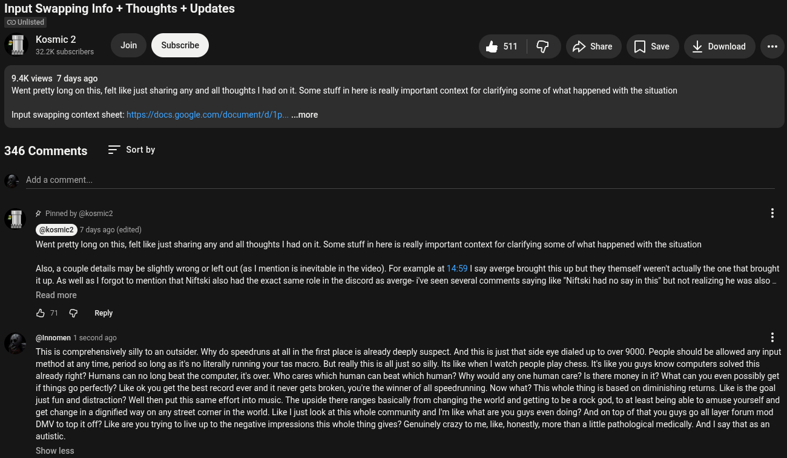

# Public Take transcript

## Machine transcription

Input Swapping Info + Thoughts + Updates

@ Unlisted

Kosmic 2 ’
322K subscribers Join & 511 G Pshae  [JSave L Download -

9.4K views 7 days ago
Went pretty long on this, felt like just sharing any and all thoughts | had on it. Some stuff in here is really important context for clarifying some of what happened with the situation

Input swapping context sheet: ittps://docs.google.com/document/d/1p.....more

346 Comments = Sortby

Add a comment.

¥’ Pinned by @kosmic2

7 days ago (edited)

Went pretty long on this, felt like just sharing any and all thoughts | had ont. Some stuff in here is really important context for clarifying some of what happened with the situation

Also, a couple details may be slightly wrong or left out (as | mention is inevitable in the video). For example at 14:59 | say averge brought this up but they themself weren' actually the one that brought
it up. As well as | forgot to mention that Niftski also had the exact same role in the discord as averge- ive seen several comments saying like "Niftski had no say in this" but not realizing he was also

Read more
&7 @ Reply
#  @innomen 1 second ago H

This is comprehensively silly to an outsider. Why do speedruns at allin the first place is already deeply suspect. And this is just that side eye dialed up to over 9000. People should be allowed any input
method at any time, period so long as its no literally running your tas macro. But really this is all just so silly.fs like when | watch people play chess. Its like you guys know computers solved this
already right? Humans can no long beat the computer, it over. Who cares which human can beat which human? Why would any one human care? Is there money in it? What can you even possibly get
if things go perfectly? Like ok you get the best record ever and it never gets broken, you'e the winner of all speedrunning. Now what? This whole thing is based on diminishing returns. Like is the goal
just fun and distraction? Well then put this same effort into music. The upside there ranges basically from changing the world and getting to be a rock god, to at least being able to amuse yourself and
get change in a dignified way on any street corner in the world. Like | just look t this whole community and 'm like what are you guys even doing? And on top of that you guys go all layer forum mod
DMV to top it off? Like are you trying to live up to the negative impressions this whole thing gives? Genuinely crazy to me, like, honestly, more than a lttle pathological medically. And | say that as an
autistic.

Show less
