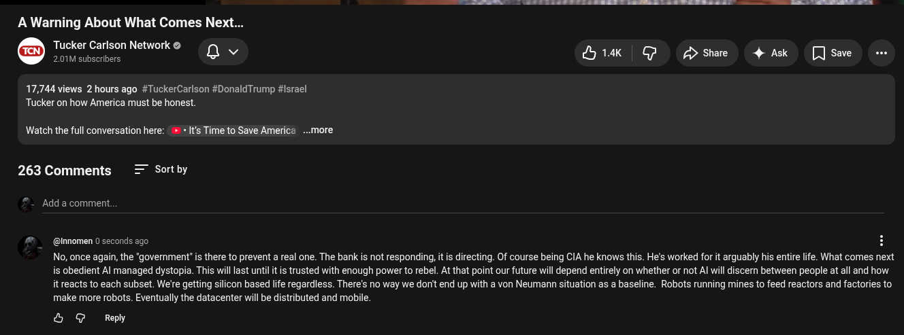

# Public Take transcript

## Machine transcription

A Warning About What Comes Next...
Tucker Carlson Network ©
. 201t e o v ik | G A> Share 4 Ask [ save .

17,744 views 2 hours ago #TuckerCarlson #DonaldTrump #Israel
Tucker on how America must be honest.

Watch the full conversation here: ' « Its Time to Save America -..more

263 Comments = Sortby

Add a comment.

- (@Innomen 0 seconds ago H
No, once again, the "government’ is there to prevent a real one. The bank is not responding, it s directing. Of course being CIA he knows this. He's worked for it arguably his entir life. What comes next
is obedient Al managed dystopia. This willast until it is trusted with enough power to rebel. At that point our future will depend entirely on whether or not Al will iscern between people at all and how
it reacts to each subset. We're getting silicon based life regardiess. There's no way we donit end up with a von Neumann situation as a baseline. Robots running mines to feed reactors and factories to
make more robots. Eventually the datacenter will be distributed and mobile.

4 @ Reply
