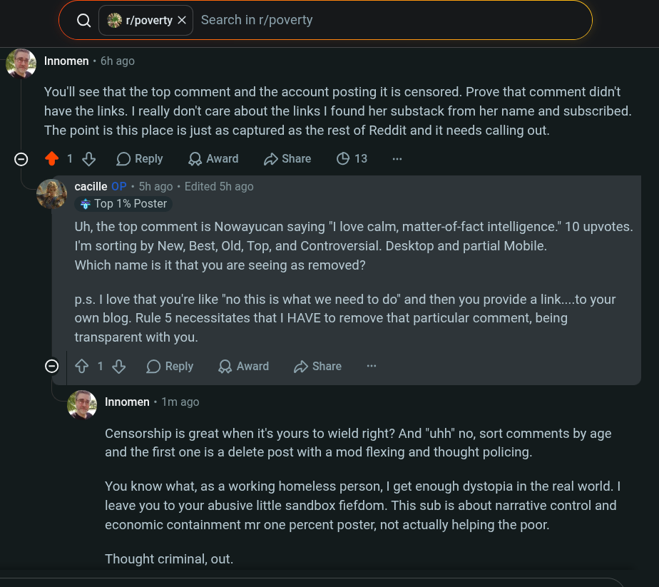

# Public Take transcript

## Machine transcription

(Q 2 r/poverty X | Search in r/poverty )

Q Innomen - 6h ago

[S]

~

You'll see that the top comment and the account posting it is censored. Prove that comment didn't
have the links. | really don't care about the links | found her substack from her name and subscribed.
The point is this place is just as captured as the rest of Reddit and it needs calling out.

218 OReply QAward Hshare O 13
cacille O - 5h ago - Edited 5h ago
% Top 1% Poster

Uh, the top comment is Nowayucan saying "l love calm, matter-of-fact intelligence.” 10 upvotes.
I'm sorting by New, Best, Old, Top, and Controversial. Desktop and partial Mobile.
Which name is it that you are seeing as removed?

p-s. I love that you're like "no this is what we need to do" and then you provide a link....to your
own blog. Rule 5 necessitates that | HAVE to remove that particular comment, being
transparent with you.

© ¢ 1% OReply QAward D Share

Q Innomen - 1m ago

Censorship is great when it's yours to wield right? And "uhh” no, sort comments by age
and the first one is a delete post with a mod flexing and thought policing.

You know what, as a working homeless person, | get enough dystopia in the real world. |
leave you to your abusive little sandbox fiefdom. This sub is about narrative control and
economic containment mr one percent poster, not actually helping the poor.

Thought criminal, out.
