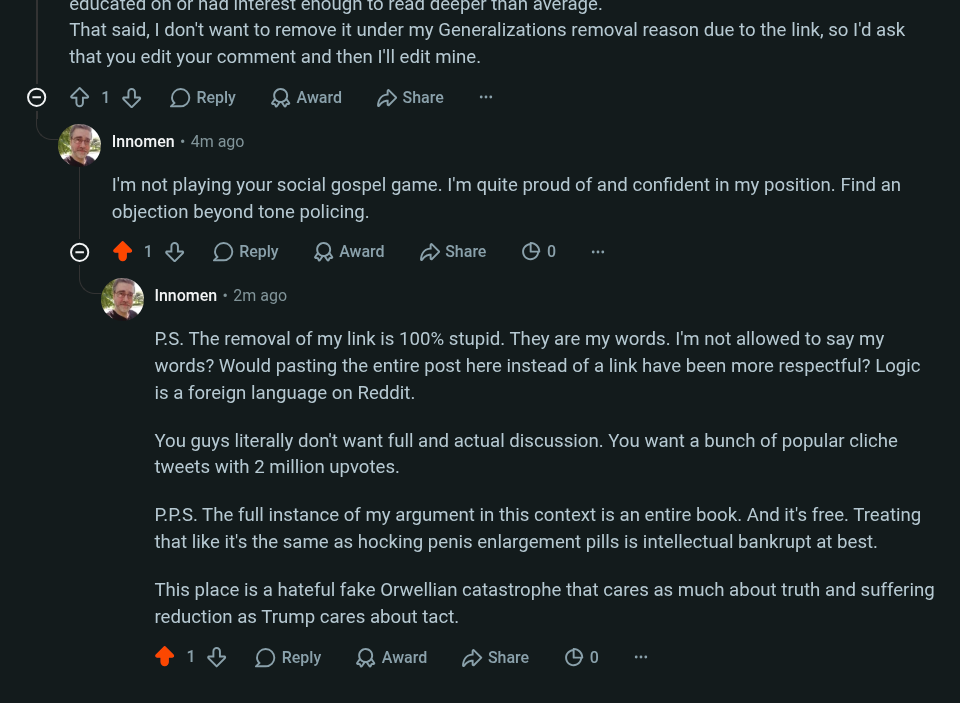

# Public Take transcript

## Machine transcription

educated onh o had interest ehough to fead deepel thah avetage.
That said, | don't want to remove it under my Generalizations removal reason due to the link, so I'd ask
that you edit your comment and then ['ll edit mine.

© {¢1& OReply QAward D Share

. Innomen + 4m ago.

I'm not playing your social gospel game. I'm quite proud of and confident in my position. Find an
objection beyond tone policing.

© 1% OReply QAwad Sshare B0

. Innomen - 2m ago

PS. The removal of my link is 100% stupid. They are my words. I'm not allowed to say my
words? Would pasting the entire post here instead of a link have been more respectful? Logic
is a foreign language on Reddit.

You guys literally don't want full and actual discussion. You want a bunch of popular cliche
tweets with 2 million upvotes.

PPS. The full instance of my argument in this context is an entire book. And it's free. Treating
that like it's the same as hocking penis enlargement pills is intellectual bankrupt at best.

This place is a hateful fake Orwellian catastrophe that cares as much about truth and suffering
reduction as Trump cares about tact.

218% OReply QAward Hshare OG0
