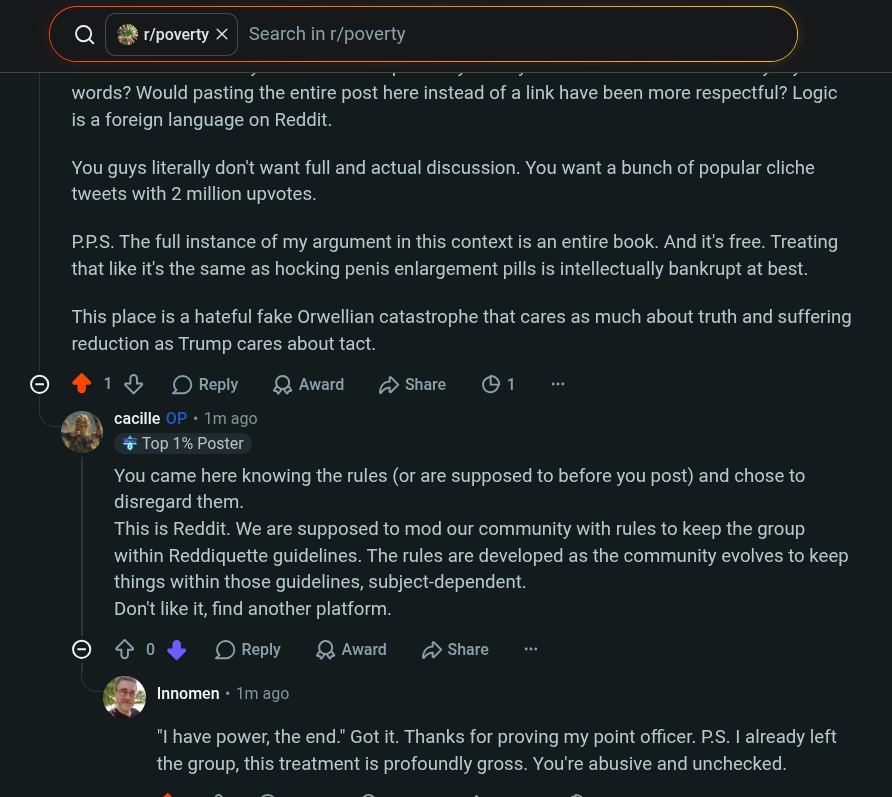

# Public Take transcript

## Machine transcription

(Q &R r/poverty X | Search in r/poverty )

[S]

words? Would pasting the entire post here instead of a link have been more respectful? Logic
is a foreign language on Reddit.

You guys literally don't want full and actual discussion. You want a bunch of popular cliche
tweets with 2 million upvotes.

PPS. The full instance of my argument in this context is an entire book. And it's free. Treating
that like it's the same as hocking penis enlargement pills is intellectually bankrupt at best.

This place is a hateful fake Orwellian catastrophe that cares as much about truth and suffering
reduction as Trump cares about tact.

418% OReply QAward Hshae O1

cacille OF « 1m ago
% Top 1% Poster

You came here knowing the rules (or are supposed to before you post) and chose to

disregard them.

This is Reddit. We are supposed to mod our community with rules to keep the group

within Reddiquette guidelines. The rules are developed as the community evolves to keep

things within those guidelines, subject-dependent.

Don't like it, find another platform.

© ¢ 0% OReply QAwad > Share

. Innomen « 1m ago.

"I have power, the end." Got it. Thanks for proving my point officer. P.S. | already left
the group, this treatment is profoundly gross. You're abusive and unchecked.
