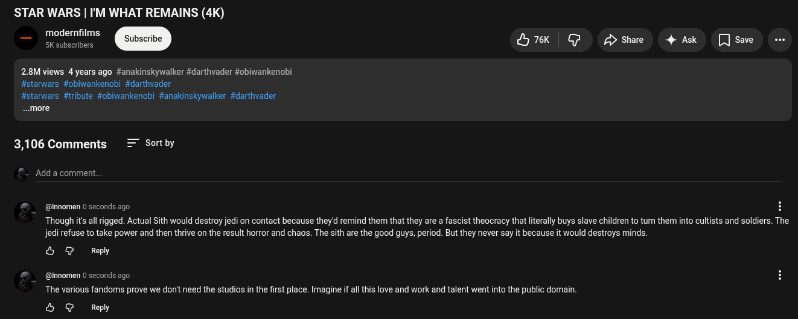

# Public Take transcript

## Machine transcription

STAR WARS | I'M WHAT REMAINS (4K)

modernfilms
5K subscribers

76k GJ 2> Share 4 Ak []Save -

2.8M views 4 years ago #anakinskywalker #darthvader #obiwankenobi
#starwars #obiwankenobi #darthvader

#starwars #tribute #obiwankenobi #anakinskywalker #darthvader
..more

3,106 Comments = Sortby
Add a comment

@ @nnomen 0 seconds ago H

Though it all rigged. Actual Sith would destroy jedi on contact because theyd remind them that they are a fascist theocracy that iterally buys slave children to tum them into cultists and soldiers. The
jedi refuse to take power and then thrive on the result horror and chaos. The sith are the good guys, period. But they never say it because it would destroys minds.

4 @ Reply

@Mnnomen 0 seconds ago

‘The various fandoms prove we donit need the studios in the first place. Imagine if all this love and work and talent went into the public domain
4 @ Reply
