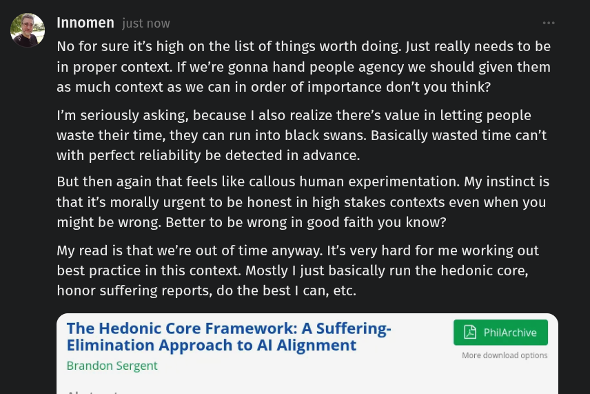

# Public Take transcript

## Machine transcription

fi Innomen

No for sure it's high on the list of things worth doing. Just really needs to be
in proper context. If we're gonna hand people agency we should given them
as much context as we can in order of importance don’t you think?

I'm seriously asking, because | also realize there’s value in letting people
waste their time, they can run into black swans. Basically wasted time can’t
with perfect reliability be detected in advance.

But then again that feels like callous human experimentation. My instinct is

that it's morally urgent to be honest in high stakes contexts even when you
might be wrong. Better to be wrong in good faith you know?

My read is that we're out of time anyway. It's very hard for me working out
best practice in this context. Mostly | just basically run the hedonic core,
honor suffering reports, do the best | can, etc.
