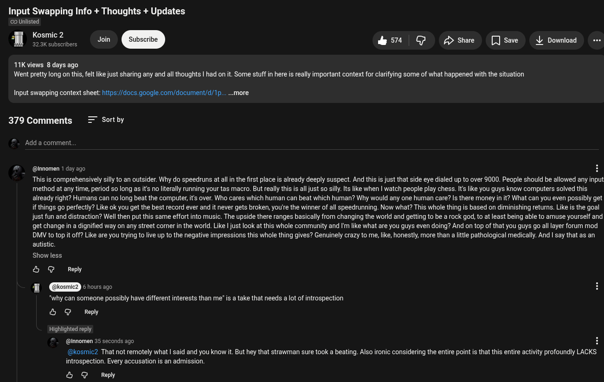

# Public Take transcript

## Machine transcription

Input Swapping Info + Thoughts + Updates

@ Unlisted

Kosmic 2 Join &5t | @ s [Jsae vownoad e

11K views 8 days ago
Wert pretty long on this, felt like just sharing any and all thoughts | had on it. Some stuff in here is really important context for clarifying some of what happened with the situation

Input swapping context sheet: ittps/docs. google com/document/d/1p.....more

379 Comments

Sortby

‘Add a comment.

@innomen 1 dey ago H
“This is comprehensively silly o an outsider. Why do speedruns at all inthe first place s lready deeply suspect. And this is just that side eye dialed up to over 9000. People should be allowed any input method at any time, period
s0long as its noiterally running your tas macro. Burt really this is alljust so silly.Its like when | watch people play chess. Its like you guys know compurters solved this already right? Humans can no long beat the computer,its
over. Who cares which human can beat which human? Why would any one human care? Is there money in it? What can you even possibly et if things go perfectly? Like ok you et the best record ever and it never gets broken,
youre the winner of all speedrunning. Now what? This whole thing is based on diminishing returns. Like is the goal just fun and distraction? Well then put this same effort into music. The upside there ranges basically from
changing the world and getting to be a rock god, to at least being able to amuse yourself and get change in a dignified way on any street corner in the world. Like | just look at this whole community and I like what are you guys
even doing? And on top of that you guys go all layer forum mod DMV to top it off? Like are you trying to live up to the negative impressions this whole thing gives? Genuinely crazy to me, like, honestly, more than a ltle
pathological medically. And I say that as an autistic.

Show less

&5 G Repy

|

6hours ago H
is atake that needs a lot of introspection

“why can someone possibly have different interests than me
O @ Repy

Highilghted reply

@nomen 18 minutes ago (ecited)
@kosmic2 That's not remotely what I said and you know it. But hey that strawman sure took a beating. Also ironic considering the entire point s that this entire activity profoundly LACKS introspection. Every.
accusation is an admission. Your entire hobby is arguably defined by utterly pointless activity and breathless seriousness applied to what i literally designed frvolity. That warrants introspection; to put it mildly. Its
Tike (What if we turned hopscotch into a death sport?) You know, it funny. You'l spend 47 minutes extemporizing on a severely niche topic, complete with google docs supporting material, but you worit engage with a
legitimate core purpose critique apart from an alllower case quarter tweet sized insult and dismissal. Again, Very revealing. *Stop asking me to think about what fm doingl" That's my read. | suspect youve never even
thought along these lines. And if you have it likely al poetic tryhard rhetoric and ancillary benefits asserted to be common to all competitive nonsense hobbies. But all of that also applies to group activiies that have
a point. Competitive stamp collecting would Iiterally be more fuitful to participants because they would gain a directly proftable appraisal skill. Tryhards suck the joy out of everything and fetishize and reify hazing and
Stockholm syndrome. Just imagine what could have been done with allthis mental and physical effort redirected into anything remotely practical. But then again maybe functionally paralyzing the type of mind that
falls for this sort of thing is the actual payoff. Maybe speedrunning is brain draining the world of thoughtless weapon makers or wall street pension raiders and other atrtopilot obsessives.

show less
