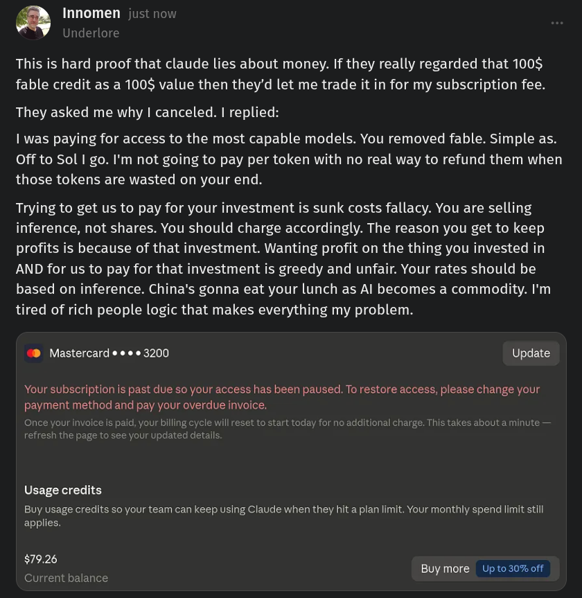

# Public Take transcript

## Machine transcription

‘L@ Innomen just now
Underlore

This is hard proof that claude lies about money. If they really regarded that 100$
fable credit as a 100$ value then they’d let me trade it in for my subscription fee.

They asked me why | canceled. | replied:

| was paying for access to the most capable models. You removed fable. Simple as.
Off to Sol | go. I'm not going to pay per token with no real way to refund them when
those tokens are wasted on your end.

Trying to get us to pay for your investment is sunk costs fallacy. You are selling
inference, not shares. You should charge accordingly. The reason you get to keep
profits is because of that investment. Wanting profit on the thing you invested in
AND for us to pay for that investment is greedy and unfair. Your rates should be
based on inference. China's gonna eat your lunch as Al becomes a commodity. I'm
tired of rich people logic that makes everything my problem.

“® Mastercard e e ¢ ¢ 3200 Update

Your subscription is past due so your access has been paused. To restore access, please change your
payment method and pay your overdue invoice.

d, your billing cycle will reset to start t

d

for no additional charge. This takes about a minute

e your updated details;

Usage credits

Buy usage credits so your team can keep using Claude when they hit a plan limit. Your monthly spend limit il
applies.

$79.26

Buy more  Up to 30% off
Current balance
