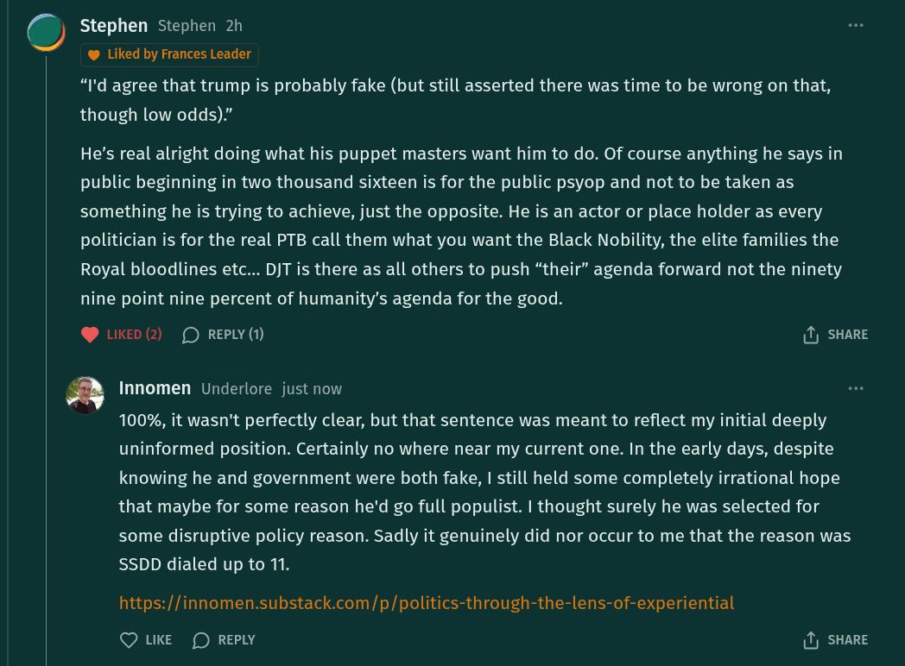

# Public Take transcript

## Machine transcription

O Stephen Stephen 2h

@ Liked by Frances Leader
“I'd agree that trump is probably fake (but still asserted there was time to be wrong on that,
though low odds).”

He's real alright doing what his puppet masters want him to do. Of course anything he says in
public beginning in two thousand sixteen is for the public psyop and not to be taken as
something he is trying to achieve, just the opposite. He is an actor or place holder as every
politician is for the real PTB call them what you want the Black Nobility, the elite families the
Royal bloodlines etc... DJT is there as all others to push “their” agenda forward not the ninety
nine point nine percent of humanity’s agenda for the good.

@ LIKED (2) (D REPLY (1) (1) SHARE

a Innomen Underlore just now
100%, it wasn't perfectly clear, but that sentence was meant to reflect my initial deeply
uninformed position. Certainly no where near my current one. In the early days, despite
knowing he and government were both fake, | still held some completely irrational hope
that maybe for some reason he'd go full populist. | thought surely he was selected for
some disruptive policy reason. Sadly it genuinely did nor occur to me that the reason was
SSDD dialed up to 11.

https://innomen.substack.com/p/politics-through-the-lens-of-experiential

Q LKE (D REPLY 1) SHARE
