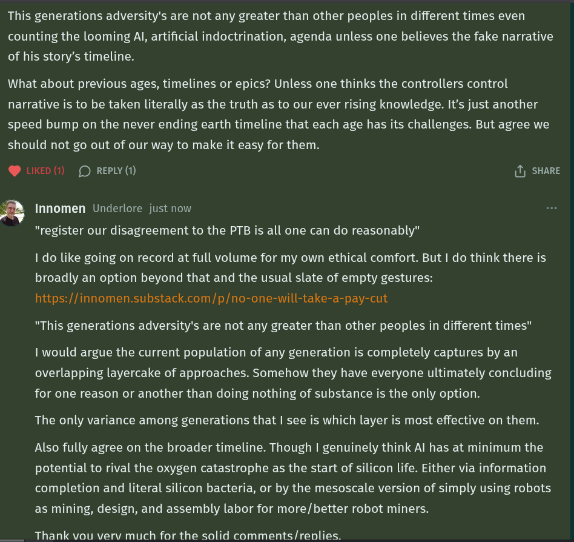

# Public Take transcript

## Machine transcription

This generations adversity's are not any greater than other peoples in different times even
counting the looming Al artificial indoctrination, agenda unless one believes the fake narrative
of his story’s timeline.

What about previous ages, timelines or epics? Unless one thinks the controllers control
narrative is to be taken literally as the truth as to our ever rising knowledge. It’s just another
speed bump on the never ending earth timeline that each age has its challenges. But agree we
should not go out of our way to make it easy for them.

@ LIKED (1) (D REPLY (1) (1) SHARE

fl Innomen Underlore just now
"register our disagreement to the PTB is all one can do reasonably"
I do like going on record at full volume for my own ethical comfort. But | do think there is

broadly an option beyond that and the usual slate of empty gestures:
https://innomen.substack.com/p/no-one-will-take-a-pay-cut

"This generations adversity's are not any greater than other peoples in different times"

I would argue the current population of any generation is completely captures by an
overlapping layercake of approaches. Somehow they have everyone ultimately concluding
for one reason or another than doing nothing of substance is the only option.

The only variance among generations that | see is which layer is most effective on them.

Also fully agree on the broader timeline. Though | genuinely think Al has at minimum the
potential to rival the oxygen catastrophe as the start of silicon life. Either via information
completion and literal silicon bacteria, or by the mesoscale version of simply using robots
as mining, design, and assembly labor for more/better robot miners.

Thank vou verv much for the solid comments/renlies.
