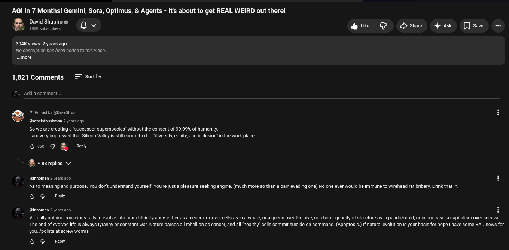

# Public Take transcript

## Machine transcription

AGl in 7 Months! Gemini, Sora, Optimus, & Agents - It's about to get REAL WEIRD out there!

DavidShapiroe (|, e | @ PDshre 4k [Jsae

304K views 2 years ago
No description has been added to this video,
~.more

1,821 Comments = Sortby

‘Add a comment.

@ # Pinned by @DaveShap
@atheistbushman 2 years ago
S0 we are creating a "successor superspecies” without the consent of 99.99% of humanity.

1am very impressed that Silicon Valley s still committed to "diversity, equity, and inclusion” in the work place.

b @ Ry Ry

2 - s8replies v

@ @imomen 2 years ago
Asto meaning and purpose. You don't understand yourself. Youre just a pleasure seeking engine. (much more 0 than a pain evading one) No one ever would be immune to wirehead rat bribery. Drink that in
& G Rey

@ @imomen 2 years ago H

Virtually nothing conscious fails to evolve into monolithic tyranny, either as a neacortex over cells as in a whale, or a queen over the hive, or a homogeneity of structure as in pando/mold, or in our case, a capitalism over survival.
The end of evolved Iife is always tyranny or constant war. Nature parses all ebellion as cancer, and all healthy” cells commit suicide on command. (Apoptosis) If natural evolution is your basis for hope | have some BAD news for
you. /points at screw worms

&5 G Repy
