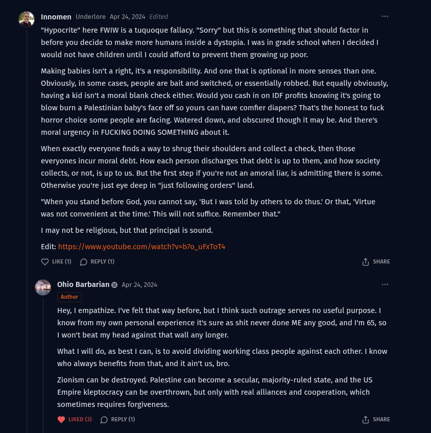

# Public Take transcript

## Machine transcription

* Innomen Underlore Apr 26,2024 E
"Hypocrite” here FWIW is a tuquoque fallacy. "Sorry” but this is something that should factor in
before you decide to make more humans inside a dystopia. | was in grade school when | decided |
would not have children until | could afford to prevent them growing up poor.

Making babies isn't a right, it's a responsibility. And one that is optional in more senses than one.
Obviously, in some cases, people are bait and switched, or essentially robbed. But equally obviously,
having a kid isn't a moral blank check either. Would you cash in on IDF profits knowing it's going to
blow burn a Palestinian baby's face off s yours can have comfier diapers? That's the honest to fuck
horror choice some people are facing. Watered down, and obscured though it may be. And there's
moral urgency in FUCKING DOING SOMETHING about it.

When exactly everyone finds a way to shrug their shoulders and collect a check, then those
everyones incur moral debt. How each person discharges that debt is up to them, and how society
collects, or not, is up to us. But the first step if you're not an amoral liar, is admitting there is some.
Otherwise you're just eye deep in “just following orders" land.

"When you stand before God, you cannot say, 'But | was told by others to do thus: Or that, "Virtue
was not convenient at the time: This will not suffice. Remember that"

1 may not be religious, but that principal is sound.

Edit: https://www.youtube.com /watch?v=b7o_uFxToT4

Q UKE®M O REPLY (1) & sHare

e Ohio Barbarian @ Apr 24, 2024
Author
Hey, | empathize. I've felt that way before, but | think such outrage serves no useful purpose. |
know from my own personal experience it's sure as shit never done ME any good, and I'm 65, so
1 won't beat my head against that wall any longer.

What | will do, as best I can, is to avoid dividing working class people against each other. I know
who always benefits from that, and it ain't us, bro.

Zionism can be destroyed. Palestine can become a secular, majority-ruled state, and the US
Empire kleptocracy can be overthrown, but only with real alliances and cooperation, which
sometimes requires forgiveness.

@ UKD () (D REPLY (1) & sHare
