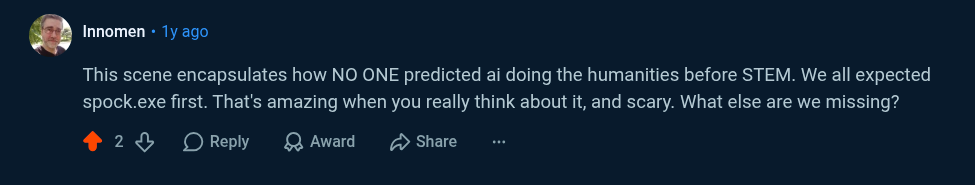

# Public Take transcript

## Machine transcription

. Innomen - Ty ago

This scene encapsulates how NO ONE predicted ai doing the humanities before STEM. We all expected
spock.exe first. That's amazing when you really think about it, and scary. What else are we missing?

428 OReply QAward 2 Share
