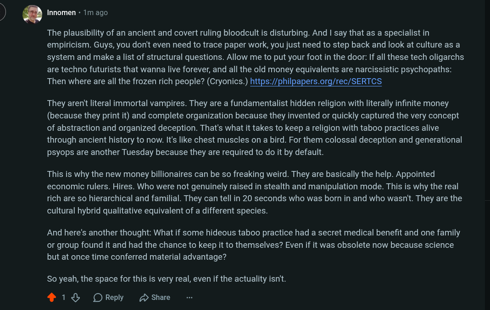

# Public Take transcript

## Machine transcription

\
)

’ Innomen + 1m ago

The plausibility of an ancient and covert ruling bloodcult is disturbing. And | say that as a specialist in
empiricism. Guys, you don't even need to trace paper work, you just need to step back and look at culture as a
system and make a list of structural questions. Allow me to put your foot in the door: If all these tech oligarchs
are techno futurists that wanna live forever, and all the old money equivalents are narcissistic psychopaths:
Then where are all the frozen rich people? (Cryonics.) https:/philpapers.org/rec/SERTCS

They aren't literal immortal vampires. They are a fundamentalist hidden religion with literally infinite money
(because they print it) and complete organization because they invented or quickly captured the very concept
of abstraction and organized deception. That's what it takes to keep a religion with taboo practices alive
through ancient history to now. It's like chest muscles on a bird. For them colossal deception and generational
psyops are another Tuesday because they are required to do it by default.

This is why the new money billionaires can be so freaking weird. They are basically the help. Appointed
economic rulers. Hires. Who were not genuinely raised in stealth and manipulation mode. This is why the real
rich are so hierarchical and familial. They can tell in 20 seconds who was born in and who wasn't. They are the
cultural hybrid qualitative equivalent of a different species.

And here's another thought: What if some hideous taboo practice had a secret medical benefit and one family
or group found it and had the chance to keep it to themselves? Even if it was obsolete now because science
but at once time conferred material advantage?

So yeah, the space for this is very real, even if the actuality isn't.

418 OReply (D Share
