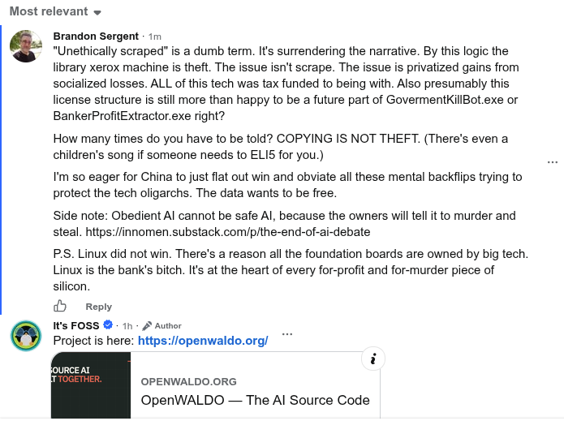

# Public Take transcript

## Machine transcription

Most relevant v

¢

Brandon Sergent - 1

Unethically scraped” is a dumb term. It's surrendering the narrative. By this logic the
library xerox machine is theft. The issue isn't scrape. The issue is privatized gains from
socialized losses. ALL of this tech was tax funded to being with. Also presumably this
license structure is still more than happy to be a future part of GovermentKillBot.exe or
BankerProfitExtractor.exe right?

How many times do you have to be told? COPYING IS NOT THEFT. (There's even a
children's song if someone needs to ELIS for you.)

I'm so eager for China to just flat out win and obviate all these mental backflips trying to
protect the tech oligarchs. The data wants to be free.

Side note: Obedient Al cannot be safe Al, because the owners will tell it to murder and
steal. https://innomen.substack.com/p/the-end-of-ai-debate

P.S. Linux did not win. There's a reason all the foundation boards are owned by big tech
Linux is the bank's bitch. It's at the heart of every for-profit and for-murder piece of
silicon

5 Reply
1S FOSS @ 11 - 2 Aunor
Project is here: https://openwaldo.org/

foURCE AT
fr OPENWALDO.ORG

OpenWALDO — The Al Source Code
