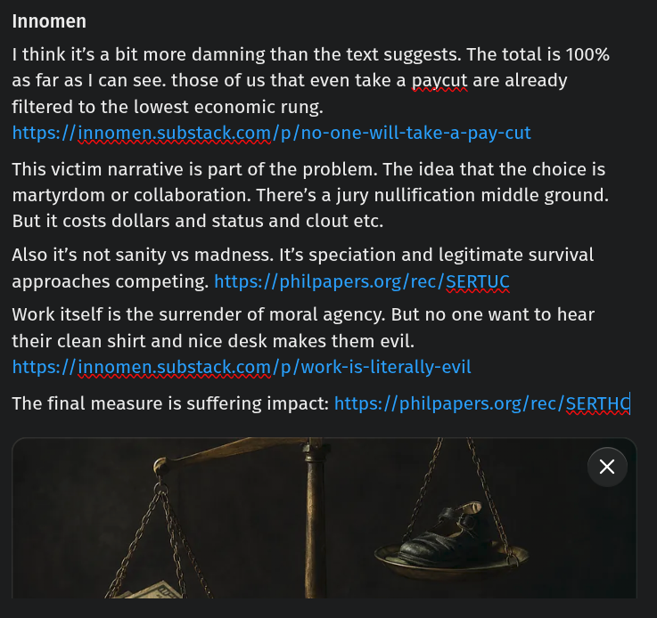

# Public Take transcript

## Machine transcription

Innomen

I think it's a bit more damning than the text suggests. The total is 100%
as far as | can see. those of us that even take a paycut are already

filtered to the lowest economic rung.
https://innomen.substack.com/p/no-one-will-take-a-pay-cut

This victim narrative is part of the problem. The idea that the choice is
martyrdom or collaboration. There’s a jury nullification middle ground.
But it costs dollars and status and clout etc.

Also it's not sanity vs madness. It's speciation and legitimate survival
approaches competing. https://philpapers.org/rec/SERTUC

Work itself is the surrender of moral agency. But no one want to hear
their clean shirt and nice desk makes them evil.
https://innomen.substack.com/p/work-is-literally-evil

The final measure is suffering impact: https://philpapers.orglrec/SERTHq

4 )
i | &
-

X
