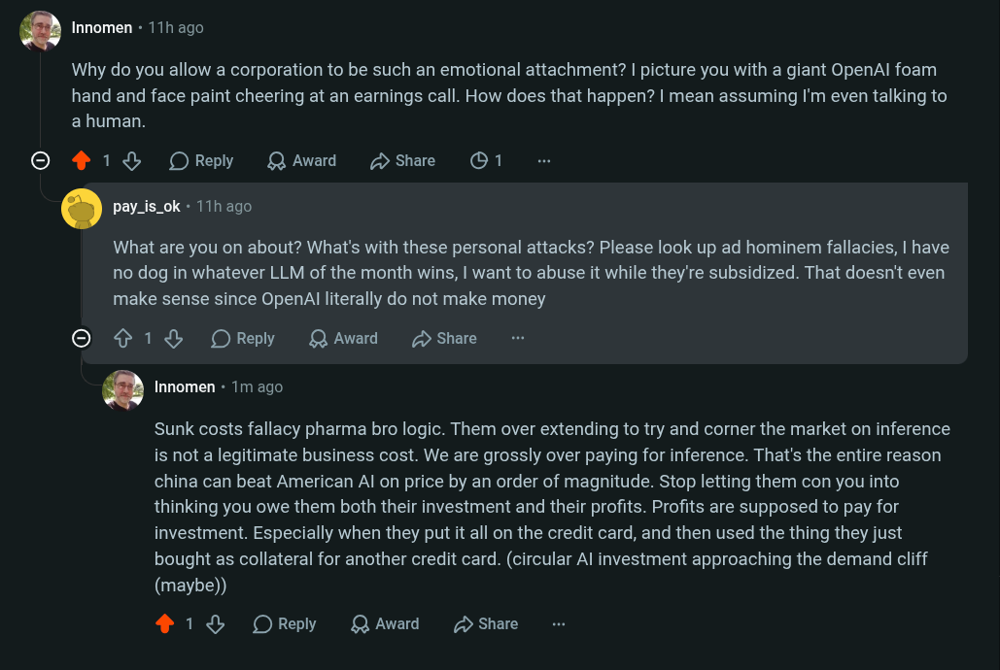

# Public Take transcript

## Machine transcription

Q Innomen - 11h ago

Why do you allow a corporation to be such an emotional attachment? | picture you with a giant OpenAl foam
hand and face paint cheering at an earnings call. How does that happen? | mean assuming I'm even talking to
a human.

© 1% OReply QAwad Dshare O1

. pay_is_ok - 11h ago

What are you on about? What's with these personal attacks? Please look up ad hominem fallacies, | have
no dog in whatever LLM of the month wins, | want to abuse it while they're subsidized. That doesn't even
make sense since OpenAl literally do not make money

O ¢ 1% OReply QAward 2 Share

Q Innomen « 1m ago.

Sunk costs fallacy pharma bro logic. Them over extending to try and corner the market on inference
is not a legitimate business cost. We are grossly over paying for inference. That's the entire reason
china can beat American Al on price by an order of magnitude. Stop letting them con you into
thinking you owe them both their investment and their profits. Profits are supposed to pay for
investment. Especially when they put it all on the credit card, and then used the thing they just
bought as collateral for another credit card. (circular Al investment approaching the demand cliff
(maybe))

418 OReply QAward D Share
