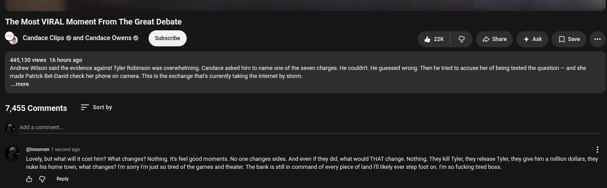

# Public Take transcript

## Machine transcription

The Most VIRAL Moment From The Great Debate

g Candace Clips @ and Candace Owens © &2k | @ Dshre 4 Ak [Jsae -

445,130 views 16 hours ago
Andrew Wilson said the evidence against Tyler Robinson was overwhelming. Candace asked him to name one of the seven charges. He couldrit. He guessed wrong. Then he tried to accuse her of being texted the question — and she
made Patrick Bet-David check her phone on camera. This is the exchange that's currently taking the intemet by storm.

.more

7,455 Comments = Sortby

‘Add a comment,

@ @momen

nd ago 4

Lovely,but what wil it cost hirm? What changes? Nothing. Its feel good moments. No one changes sides. And even if they did, what would THAT change. Nothing. They ki Tyler, they release Tyler, they give him a million dollars, they
nuke his home town, what changes? f'm sorry fm just so tired of the games and theater. The bank is stillin command of every piece of land Il likely ever step foot on. I'm so fucking tired boss.

& G Ry
