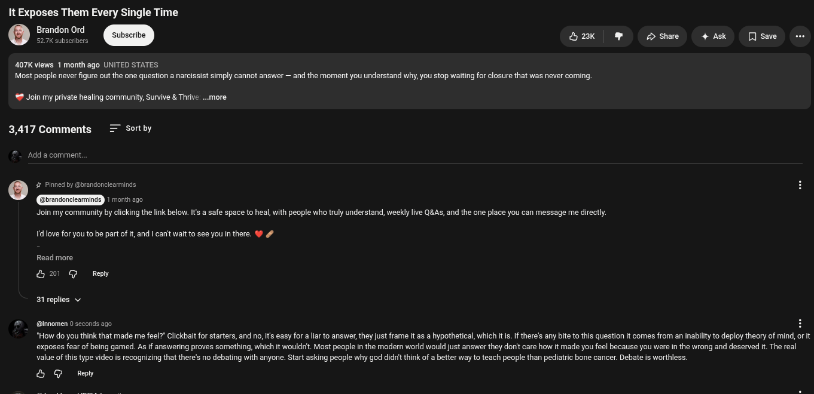

# Public Take transcript

## Machine transcription

It Exposes Them Every Single Time

407K views 1 month ago UNITED STATES
Most people never figure out the one question a narcissist simply cannot answer — and the moment you understand why, you stop wating for closure that was never coming.

# Join my private healing community, Survive & Thrive ..more

3,417 Comments = Sortby

‘Add a comment,

O # Pinned by @brandonclearminds.

Join my community by clicking the link below. Its a safe space to heal, with people who truly understand, weekly live Q&As, and the one place you can message me directl.

d love for youto be part of t, and | canit wait to see you in there. %

Read more
&0 G Repy
31 replies v

@ @inomen 0 seconds ago H

"How do you think that made me feel?” Clickbait for starters, and no, its easy for alar to answer, they just frame it as a hypothetical, which itis.If there's any bite to this question it comes from an inabilty to deploy theory of mind, or it
exposes fear of being gamed. As if answering proves something, which it wouldrit. Most people in the modern world would just answer they don't care how it made you feel because you were in the wrong and deserved it. The real
value of this type video is recognizing that there's no debating with anyone. Start asking people why god didit think of a better way to teach people than pediatric bone cancer. Debate is worthless.

& G Ry
