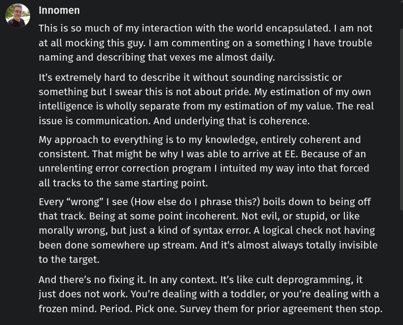

# Public Take transcript

## Machine transcription

Innomen

This is so much of my interaction with the world encapsulated. | am not
at all mocking this guy. | am commenting on a something | have trouble
naming and describing that vexes me almost daily.

It's extremely hard to describe it without sounding narcissistic or
something but | swear this is not about pride. My estimation of my own
intelligence is wholly separate from my estimation of my value. The real
issue is communication. And underlying that is coherence.

My approach to everything is to my knowledge, entirely coherent and
consistent. That might be why | was able to arrive at EE. Because of an
unrelenting error correction program | intuited my way into that forced
all tracks to the same starting point.

Every “wrong” | see (How else do | phrase this?) boils down to being off
that track. Being at some point incoherent. Not evil, or stupid, or like
morally wrong, but just a kind of syntax error. A logical check not having
been done somewhere up stream. And it's almost always totally invisible
to the target.

And there’s no fixing it. In any context. It's like cult deprogramming, it
just does not work. You're dealing with a toddler, or you're dealing with a
frozen mind. Period. Pick one. Survey them for prior agreement then stop.
