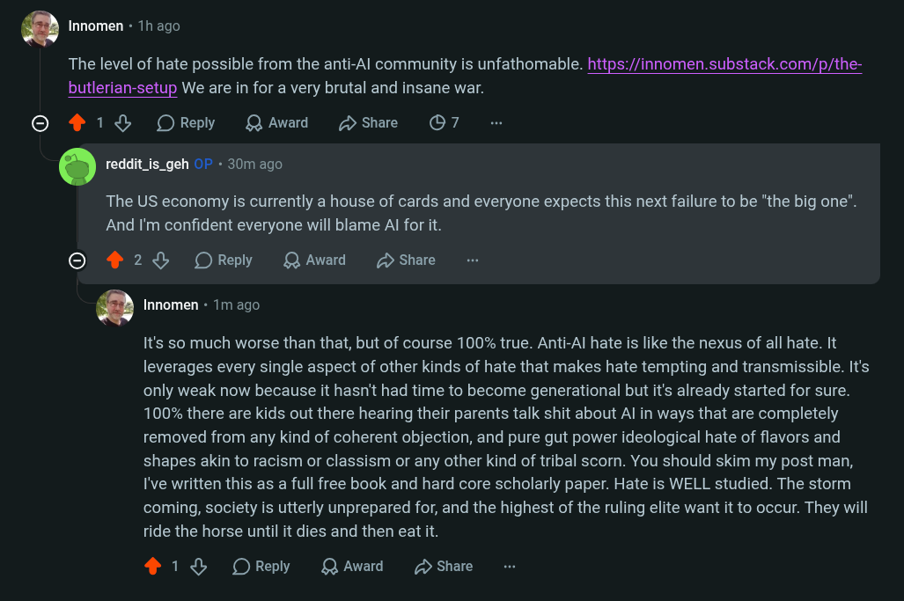

# Public Take transcript

## Machine transcription

a Innomen - 1h ago

The level of hate possible from the anti-Al community is unfathomable. https://innomen.substack.com/p/the-
butlerian-setup We are in for a very brutal and insane war.

© 1% OReply QAwad DShare O7

. reddit_is_geh 0 - 30m ago

The US economy is currently a house of cards and everyone expects this next failure to be "the big one".
‘And I'm confident everyone will blame Al for it.

O 428 OReply QAward 2 Share

a Innomen « 1m ago.

It's so much worse than that, but of course 100% true. Anti-Al hate is like the nexus of all hate. It
leverages every single aspect of other kinds of hate that makes hate tempting and transmissible. It's
only weak now because it hasn't had time to become generational but it's already started for sure.
100% there are kids out there hearing their parents talk shit about Al in ways that are completely
removed from any kind of coherent objection, and pure gut power ideological hate of flavors and
shapes akin to racism or classism or any other kind of tribal scorn. You should skim my post man,
I've written this as a full free book and hard core scholarly paper. Hate is WELL studied. The storm
coming, society is utterly unprepared for, and the highest of the ruling elite want it to occur. They will
ride the horse until it dies and then eat it.

418 OReply QAward D Share
