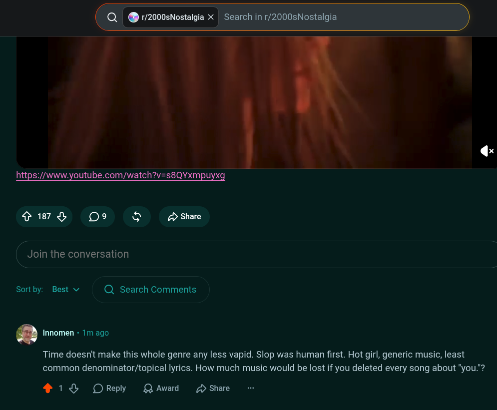

# Public Take transcript

## Machine transcription

https://www.youtube.com/watch?v=s8QYxmpuyxg

o187 O 09 & £ Share

[ Join the conversation

Sortby: Best v Q Search Comments

‘ Innomen - 1m ago

Time doesn't make this whole genre any less vapid. Slop was human first. Hot girl, generic music, least
common denominator/topical lyrics. How much music would be lost if you deleted every song about "you."?

418 OReply QAward (D Share
