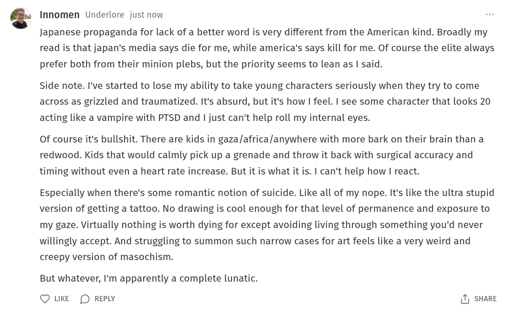

# Public Take transcript

## Machine transcription

Innomen Underlore just now

Japanese propaganda for lack of a better word is very different from the American kind. Broadly my
read is that japan's media says die for me, while america's says kill for me. Of course the elite always
prefer both from their minion plebs, but the priority seems to lean as | said.

Side note. I've started to lose my ability to take young characters seriously when they try to come
across as grizzled and traumatized. It's absurd, but it's how | feel. | see some character that looks 20
acting like a vampire with PTSD and | just can't help roll my internal eyes.

Of course it's bullshit. There are kids in gaza/africa/anywhere with more bark on their brain than a
redwood. Kids that would calmly pick up a grenade and throw it back with surgical accuracy and
timing without even a heart rate increase. But it is what it is. | can't help how | react.

Especially when there's some romantic notion of suicide. Like all of my nope. It's like the ultra stupid
version of getting a tattoo. No drawing is cool enough for that level of permanence and exposure to
my gaze. Virtually nothing is worth dying for except avoiding living through something you'd never
willingly accept. And struggling to summon such narrow cases for art feels like a very weird and
creepy version of masochism.

But whatever, I'm apparently a complete lunatic.

Q LKE (D REPLY 1) SHARE
