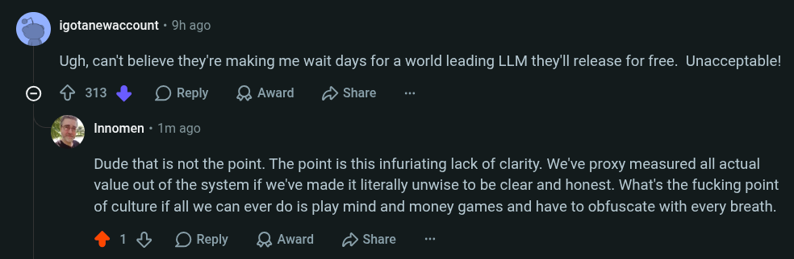

# Public Take transcript

## Machine transcription

. igotanewaccount - 9h ago

Ugh, can't believe they're making me wait days for a world leading LLM they'll release for free. Unacceptable!

© {313 % OReply LK Award 2> Share

‘ Innomen - 1m ago

Dude that is not the point. The point is this infuriating lack of clarity. We've proxy measured all actual
value out of the system if we've made it literally unwise to be clear and honest. What's the fucking point
of culture if all we can ever do is play mind and money games and have to obfuscate with every breath.

418 OReply QAward D Share
