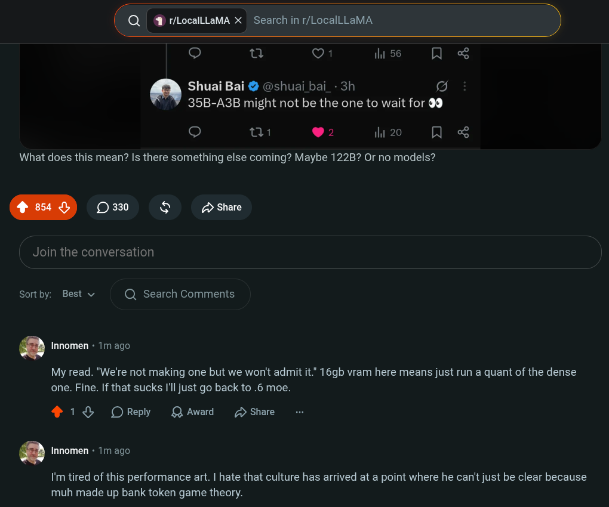

# Public Take transcript

## Machine transcription

(Q @ r/LocalLLaMA X | Search in r/LocalLLaMA )

o iy Q1 ihi 56 N <

Shuai Bai @ @shuai bai_- 3h o]
35B-A3B might not be the one to wait for 89

o} o1 92 ili 20 N <

What does this mean? Is there something else coming? Maybe 122B? Or no models?

Join the conversation

Sortby: Best v Q Search Comments

. Innomen + 1m ago

My read. "We're not making one but we won't admit it." 16gb vram here means just run a quant of the dense
one. Fine. If that sucks I'll just go back to .6 moe.

4 18% OReply QAward D Share

. Innomen + 1m ago

I'm tired of this performance art. | hate that culture has arrived at a point where he can't just be clear because
muh made up bank token game theory.
