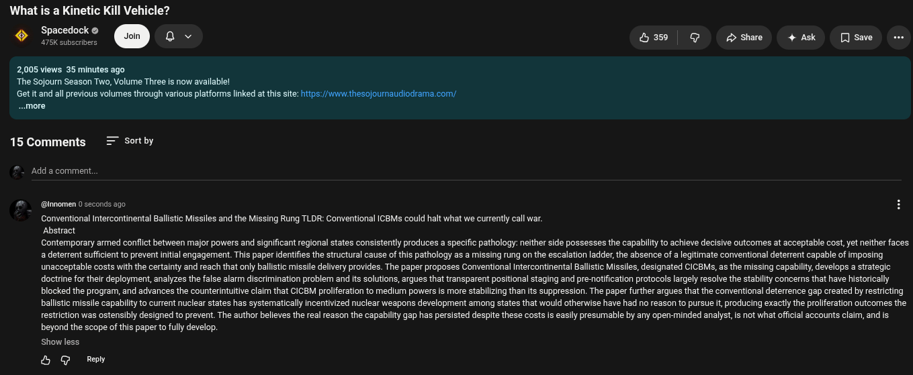

# Public Take transcript

## Machine transcription

What is a
S Spacedock © @ @ o Hsw | @ 2> share + Ask [ save

2,005 views 35 minutes ago
‘The Sojourn Season Two, Volume Three is now available!

Getit and all previous volumes through various platforms linked at this site: https: /v thesojournaudiodrama com/
~.more

15 Comments = Sortby

‘Add a comment,

@ @imomen 0 seconds ago
Conventional Intercontinental Ballstic Missiles and the Missing Rung TLDR: Conventional ICBMs could halt what we currently call war.
Abstract
Contemporary armed conflict between major powers and significant regional states consistently produces a specific pathology: neither side possesses the capabilty to achieve decisive outcomes at acceptable cost,yet neither faces
a deterrent sufficient to prevernt initial engagement. This paper identifies the structural cause of this pathology as a missing rung on the escalation ladder, the absence of a legitimate conventional deterrent capable of imposing
unacceptable costs with the certainty and reach that only ballistic missile delivery provides. The paper proposes Conventional Intercontinental Ballistic Missiles, designated CICBMSs, as the missing capabiliy, develops a strategic:
doctrine for their deployment, analyzes the false alarm discrimination problem and its solutions, argues that transparent positional staging and pre-notification protocols largely resalve the stability concerns that have historically
blocked the program, and advances the counterintuitive claim that CICBM proliferation to medium powers is more stabilizing than its suppression. The paper further argues that the conventional deterrence gap created by restricting
ballistic missile capability to current nuclear states has systematically incentivized nuclear weapons development among states that would otherwise have had no reason to pursue it producing exactly the proliferation outcomes the
restriction was ostensibly designed to prevent. The author believes the real reason the capability gap has persisted despite these costs is easily presumable by any open-minded analyst, is not what offcial accounts claim, and is
beyond the scope of this paper to fully develop.

show less

& G Redy
