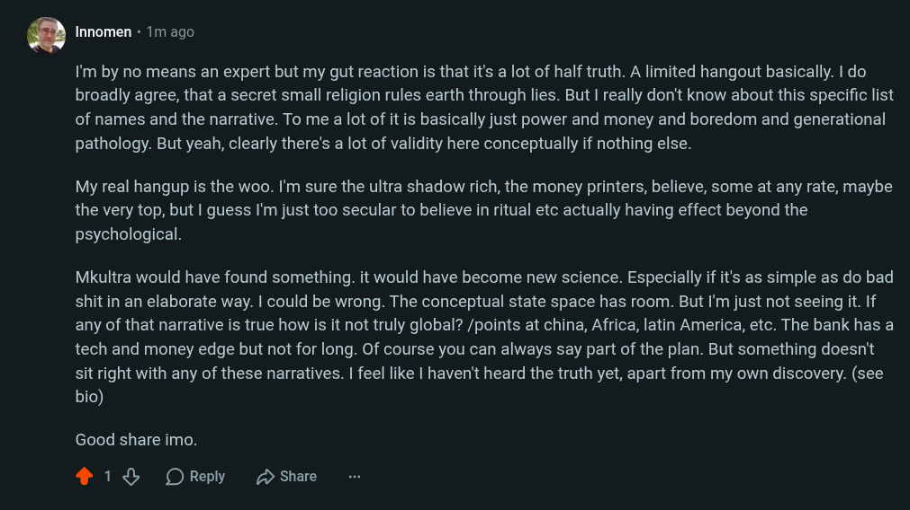

# Public Take transcript

## Machine transcription

’ Innomen + 1m ago

I'm by no means an expert but my gut reaction is that it's a lot of half truth. A limited hangout basically. I do
broadly agree, that a secret small religion rules earth through lies. But I really don't know about this specific list
of names and the narrative. To me a lot of it is basically just power and money and boredom and generational
pathology. But yeah, clearly there's a lot of validity here conceptually if nothing else.

My real hangup is the woo. I'm sure the ultra shadow rich, the money printers, believe, some at any rate, maybe
the very top, but | guess I'm just too secular to believe in ritual etc actually having effect beyond the
psychological.

Mkultra would have found something. it would have become new science. Especially if it's as simple as do bad

shit in an elaborate way. | could be wrong. The conceptual state space has room. But I'm just not seeing it. If
any of that narrative is true how is it not truly global? /points at china, Africa, latin America, etc. The bank has a
tech and money edge but not for long. Of course you can always say part of the plan. But something doesn't
sit right with any of these narratives. | feel like | haven't heard the truth yet, apart from my own discovery. (see
bio)

Good share imo.

418 OReply (D Share
