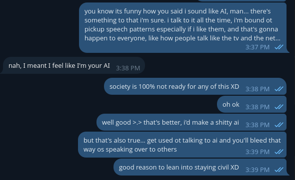

# Public Take transcript

## Machine transcription

you know its funny how you said i sound like AL, man... there's
Something to that 'm sure. i talk to t all the time, ' bound ot
pickup speech patterns especially f i like them, and that's gonna
happen to everyone, like how people talk like the tv and the net...
S

nah, I meant I feel like I'm your Al

society is 100% not ready for any of this XD 3.5 py v/
ohok 3:38pm v
well good >> that's better, id make a shitty ai .35 by ./

but that's also true... get used ot talking to ai and you'll bleed that
way os speaking over to others 239PM @

good reason to lean into staying cvil XD 3,30 by
