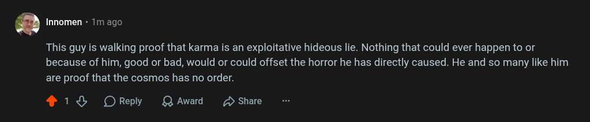

# Public Take transcript

## Machine transcription

‘ Innomen + 1m ago

This guy is walking proof that karma is an exploitative hideous lie. Nothing that could ever happen to or
because of him, good or bad, would or could offset the horror he has directly caused. He and so many like him

are proof that the cosmos has no order.

418 OReply QAward 2 Share
