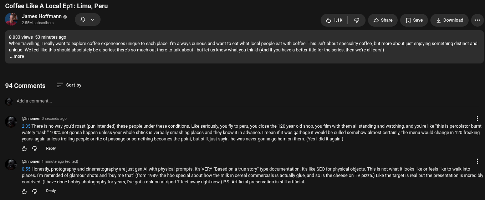

# Public Take transcript

## Machine transcription

Coffee Like A Local Ep1: Lima, Peru

J?TAETZTTH" ° o~ H1K | @ Hshae  [ISave L Download e

8,033 views 53 minutes ago
‘When travelling, | really want to explore coffee experiences unique to each place. Im always curious and want to eat what local people eat with coffee. This isn't about speciality coffee, but more about ust enjoying something distinct and
unique. We feellike this should absolutely be a series; there's so much out there to talk about - butlet us know what you think! (And if you have a better title for the series, then we're all earsi)

~.more

94 Comments Sort by

‘Add a comment,

#  @innomen 0 seconds ago H
2:35 There is no way you'd roast (pun intended) these people under these conditions. Like seriously, you fly to peru, you close the 120 year old shop, you film with them all standing and watching, and yourre like this is percolator burnt
‘watery trash." 100% not gonna happen unless your whole shtick is verbally smashing places and they know it n advance. | mean if it was garbage it would be culled somehow almost certainly, the menu would change in 120 freaking
years, again unless trolling people or rite of passage or something becomes the point, but sl just sayin, he was never gonna go ham on them. (es | did it again.)

& G Ry

@ @momen 1 minute ago (ediec)

0:55 Honestly, photography and cinematography are just gen Al with physical prompts. Its VERY "Based on a true story” type documentation. Its like SEO for physical objects. This is not what it looks like or feels like to walk into
places. Im reminded of glamour shots and 'buy me that” (from 1989, the hbo special about how the milk in cereal commercials is actually glue, and so is the cheese on TV pizza.) Like the target s real but the presentation is incredibly

contrived. (1 have done hobby photography for years, I've got a dsir on a tripod 7 feet away right now.) PS. Artificial preservation is stil artfcial.

& G Redy
