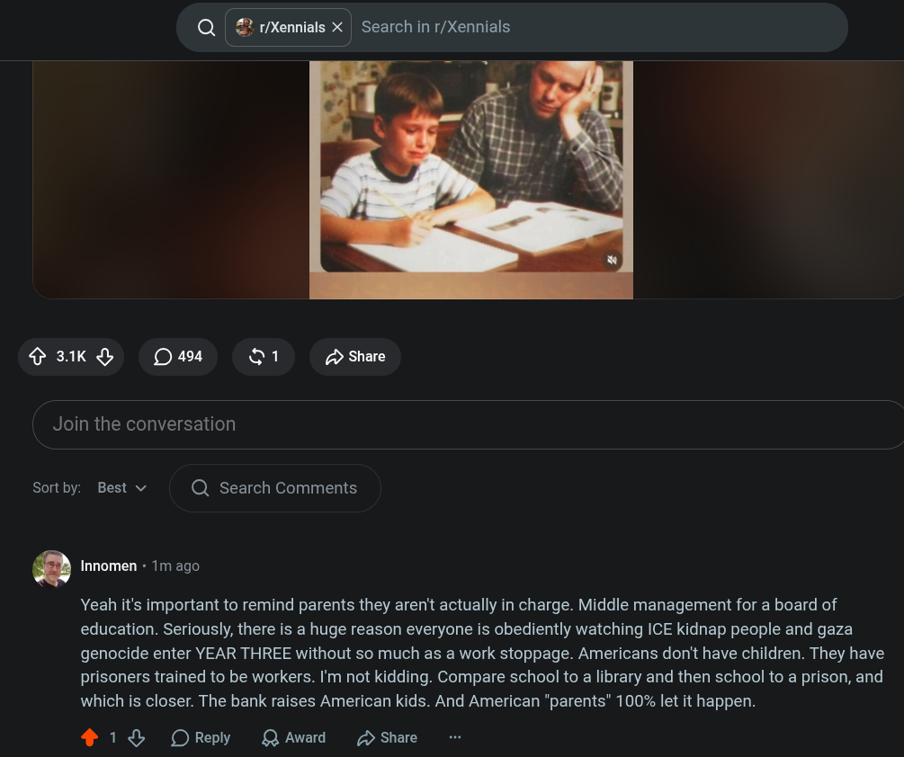

# Public Take transcript

## Machine transcription

Q | £ t/Xennials X | Search in r/Xennials

3.1K 494 1 Share
i

Join the conversation

Sortby: Best v Q Search Comments

O Innomen + 1m ago

Yeah it's important to remind parents they aren't actually in charge. Middle management for a board of
education. Seriously, there is a huge reason everyone is obediently watching ICE kidnap people and gaza
genocide enter YEAR THREE without so much as a work stoppage. Americans don't have children. They have
prisoners trained to be workers. I'm not kidding. Compare school to a library and then school to a prison, and
which is closer. The bank raises American kids. And American "parents” 100% let it happen.

4 18% OReply QAward D Share
