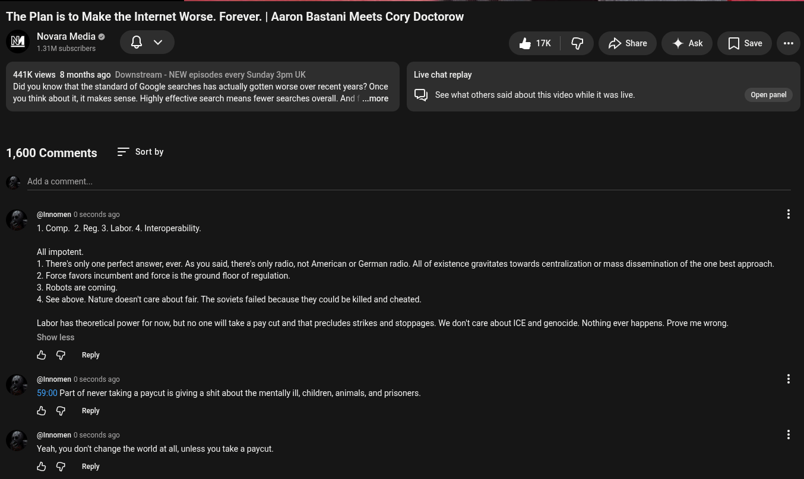

# Public Take transcript

## Machine transcription

The Plan is to Make the Internet Worse. Forever. | Aaron Bastani Meets Cory Doctorow

Novara Media ©
L Rakev i A U2 I S Y
441K views 8 months ago Downstream - NEW episodes every Sunday 3pm UK Live chat replay

Did you know that the standard of Google searches has actually gotten worse over recent years? Once

you think about it, it makes sense. Highly effective search means fewer searches overall. And | ...more ) See what others said about this video while it was live. i)

1,600 Comments = Sortby

Add a comment.

@ @innomen 0 seconds ago
1. Comp. 2. Reg. 3. Labor. 4. Interoperability.

Allimpotent
1. There's only one perfect answer, ever. As you said, there's only radio, not American or German radio. All of existence gravitates towards centralization or mass dissemination of the one best approach.

2. Force favors incumbent and force is the ground floor of regulation

3. Robots are coming.
4. See above. Nature doesn' care about fair. The soviets failed because they could be killed and cheated.

Labor has theoretical power for now, but no one willtake a pay cut and that precludes strikes and stoppages. We donit care about ICE and genocide. Nothing ever happens. Prove me wrong.
Show less

& G Reply

@ @innomen 0 seconds ago
5900 Part of never taking a paycutis giving a shit about the mentally i, children, animels, and prisoners.

& G Reply

@ @innomen 0 seconds ago H
Yeah, you dorit change the world at all,unless you take a paycut.

& G Reply
