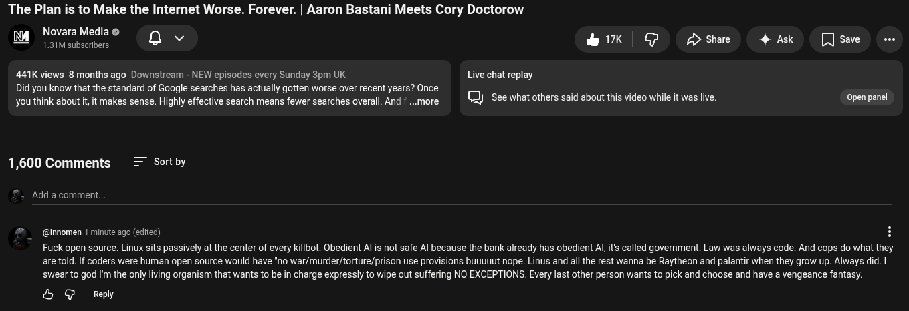

# Public Take transcript

## Machine transcription

The Plan is to Make the Internet Worse. Forever. | Aaron Bastani Meets Cory Doctorow

Novara Media & Q ©
1.31M subscribers

&k G /> Share 4 Ask [ save

441K views 8 months ago Downstream - NEW episodes every Sunday 3pm UK
Did you know that the standard of Google searches has actually gotten worse over recent years? Once ) . )
you think about it, it makes sense. Highly effective search means fewer searches overall. And | ...more ) See what others said about this video while it was live.

Live chat replay

pen panel

1,600 Comments Sort by

Add a comment.

@nnomen 1 minute ago (edited)

Fuck open source. Linux sits passively at the center of every killoot. Obedient Al is not safe Al because the bank already has obedient Al it called government. Law was always code. And cops do what they
are told. If coders were human open source would have 'no war/murder/torture/prison use provisions buuuuut nope. Linus and all the rest wanna be Raytheon and palantir when they grow up. Always did. |
swear to god I'm the only living organism that wants to be in charge expressly to wipe out suffering NO EXCEPTIONS. Every last other person wants to pick and choose and have a vengeance fantasy.

& G Reply
