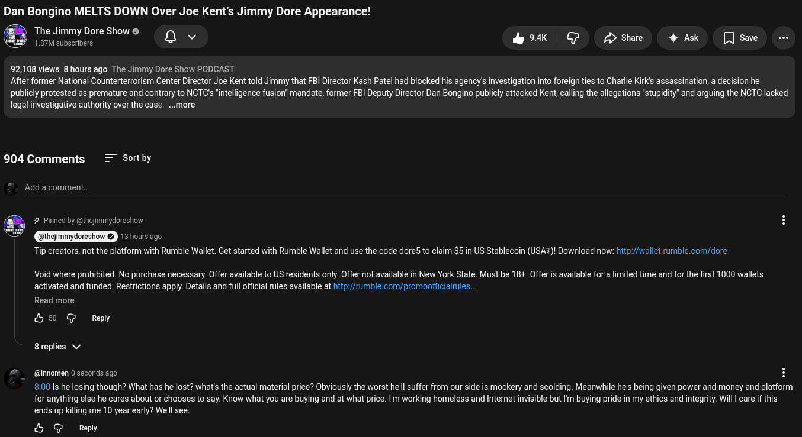

# Public Take transcript

## Machine transcription

Dan Bongino MELTS DOWN Over Joe Kent's Jimmy Dore Appearance!

The Jimmy Dore Show
1.87M subscrbers Qv

ok Gp /> Share 4 Ask [Jsave -

92,108 views 8 hours ago The Jimmy Dore Show PODCAST
After former National Counterterrorism Center Director Joe Kent told Jimmy that FBI Director Kash Patel had blocked his agency's investigation into foreign ties to Charlie Kirk's assassination, a decision he

publicly protested as premature and contrary to NCTC's intelligence fusion” mandate, former FBI Deputy Director Dan Bongino publicly attacked Kent, caling the allegations "stupidity” and arguing the NCTC lacked
legal investigative authority over the case. ...more

904 Comments = Sortby

Add a comment.

# Pinned by @thejimmydoreshow

3 hours ago

Tip creators, not the platform with Rumble Wallet. Get started with Rumble Wallet and use the code dore5 to claim $5 in US Stablecoin (USAF)! Download now: http://wallet rumble.com/dore.

Void where prohibited. No purchase necessary. Offer available to US residents only. Offer not available in New York State. Must be 18+. Offeris available for a limited time and for the first 1000 wallets
activated and funded. Restrictions apply. Details and full official rules available at htp://rumble.com/promoofficialrules.

Read more
& 50 G Repy
8replies v
#  @innomen 0 seconds ago H

80015 he losing though? What has he lost? what's the actual material price? Obviously the worst he'll suffer from our side is mockery and scolding. Meanwhile he's being given power and money and platform

for anything else he cares about or chooses to say. Know what you are buying and at what price. Im working homeless and Internet invisible but fm buying pride in my ethics and integrity. Will | care if this
ends up killing me 10 year early? We'll see.

& @ Reply
