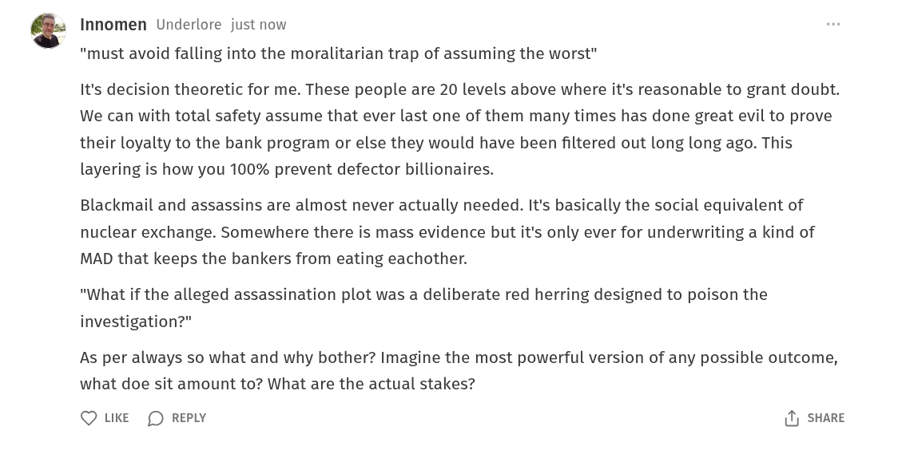

# Public Take transcript

## Machine transcription

Innomen Underlore just now

"must avoid falling into the moralitarian trap of assuming the worst"

It's decision theoretic for me. These people are 20 levels above where it's reasonable to grant doubt.
We can with total safety assume that ever last one of them many times has done great evil to prove
their loyalty to the bank program or else they would have been filtered out long long ago. This
layering is how you 100% prevent defector billionaires.

Blackmail and assassins are almost never actually needed. It's basically the social equivalent of
nuclear exchange. Somewhere there is mass evidence but it's only ever for underwriting a kind of
MAD that keeps the bankers from eating eachother.

"What if the alleged assassination plot was a deliberate red herring designed to poison the
investigation?"

As per always so what and why bother? Imagine the most powerful version of any possible outcome,
what doe sit amount to? What are the actual stakes?

Q LKE (D REPLY 1) SHARE
